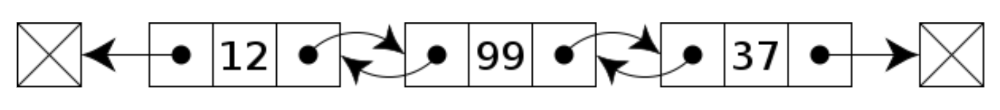

# Package container/list
- Package container/list adalah implementasi struktur data double linked list di Go-Lang.
- [https://golang.org/pkg/container/list/](https://golang.org/pkg/container/list/)

#Struktur Data Double Linked List


# Kode Program Package container/list
```go
package main

import (
  "container/list"
  "fmt"
)

func main() {
  data := list.New()
  data.PushBack("Sandy")
  data.PushBack("Dwi")
  data.PushBack("Handoko")
  data.PushBack("Trapsilo")

  for e := data.Front(); e != nil; e = e.Next() {
    fmt.Println(e.Value)
  }
}
```