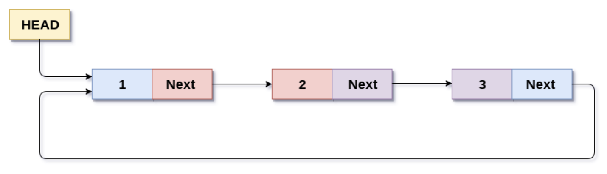

# Package container/ring
- Package container/ring adalah implementasi struktur data circular list.
- Circular list adalah struktur data ring, dimana diakhir element akan kembali ke element awal (HEAD).
- [https://golang.org/pkg/container/ring](https://golang.org/pkg/container/ring).

# Struktur Data Circular List


# Kode Program Package container/ring
```go
package main

import (
  "container/ring"
  "fmt"
  "strconv"
)

func main() {
  data := ring.New(5)
  for i := 0; i < data.Len(); i++ {
    data.Value = "Value " + strconv.FormatInt(int64(i), 10)
    data = data.Next()
  }

  data.Do(func(value interface{}) {
    fmt.Println(value)
  })
}
```